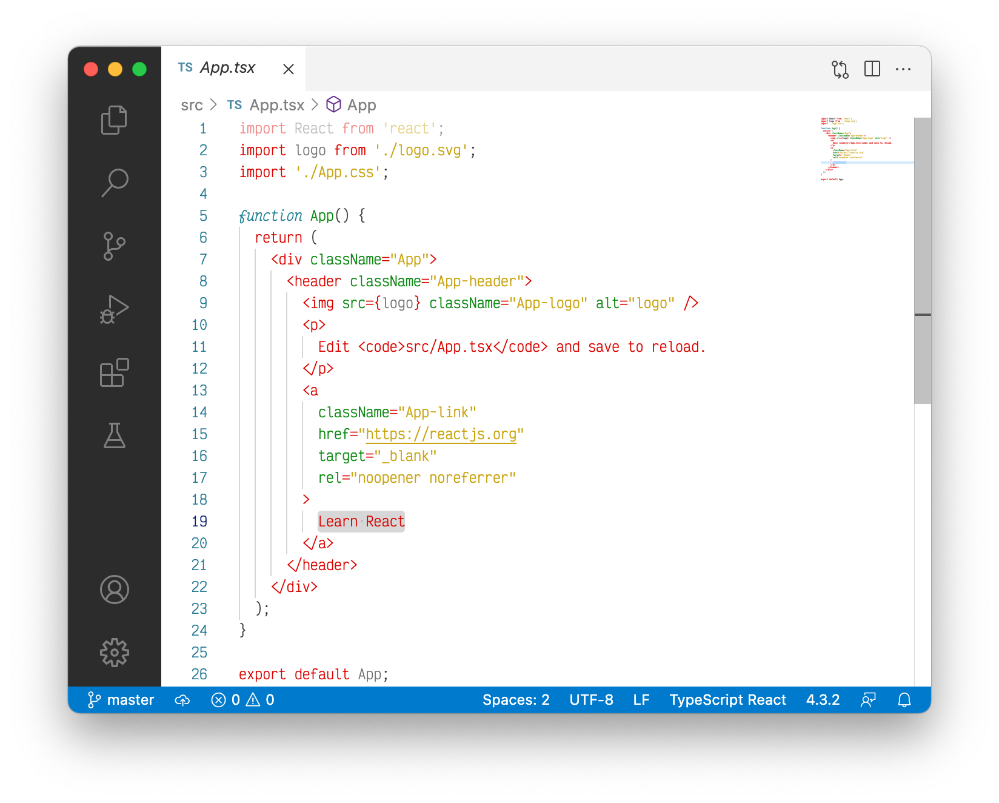
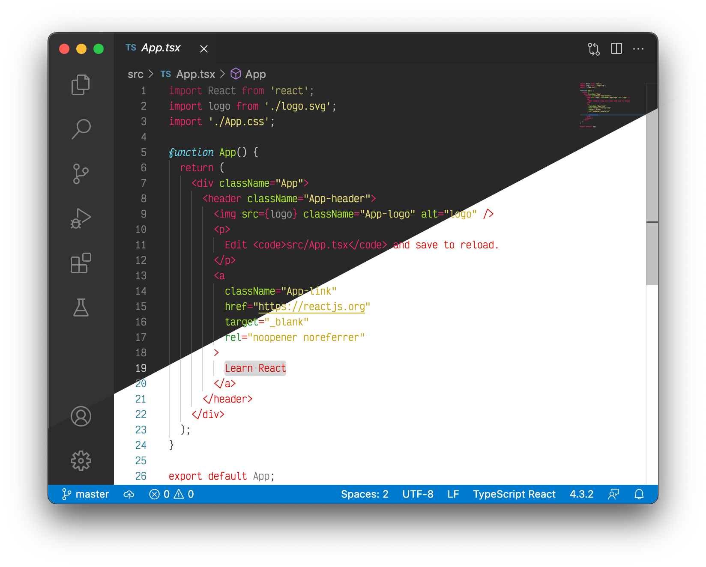

# Monokai Light theme for VS Code
This theme has a bright background with dark text and uses accompanying colors loosely based on the original Monokai theme.

This theme is designed to accompany the [monokai-dark](https://github.com/moritzmhmk/vscode-monokai-dark) when used with automatic dark-/lightmode switching.

This theme is based on [babsveloso](https://github.com/babsveloso/atom-monokai-light)'s mod of the original Monokai port by [kevinsawicki](https://github.com/kevinsawicki/monokai).